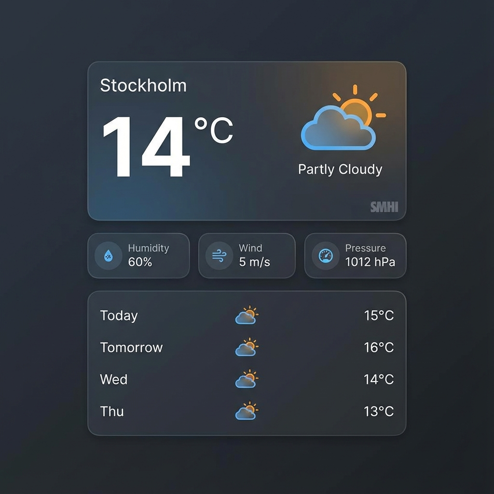

# SMHI ODP Weather for Home Assistant

[](https://github.com/hacs/integration)

Get comprehensive weather data from SMHI (Sveriges meteorologiska och hydrologiska institut) directly in Home Assistant. This custom integration uses the Open Data API to provide accurate current conditions and 10-day forecasts for any location in Sweden.



## Features

*   **Weather Platform**: A standard `weather` entity (e.g., `weather.smhi_home`) with current conditions and a 10-day forecast.
*   **Current Conditions**: Temperature, Humidity, Wind Speed, Wind Direction, Pressure, and Precipitation.
*   **10-Day Forecast**: Daily sensors showing the maximum temperature for the day, with detailed forecast data available as attributes.
*   **Localization**: Fully localized for English and Swedish.
*   **Easy Configuration**: Setup via the Home Assistant UI.

## Installation

### Option 1: HACS (Recommended)

1.  Open HACS in Home Assistant.
2.  Go to **Integrations** > **Triple dots** (top right) > **Custom repositories**.
3.  Paste the URL of this repository: `https://github.com/Tiimber/smhi_odp`
4.  Select **Integration** as the category.
5.  Click **Add**.
6.  Find **SMHI ODP** in the list and install it.
7.  Restart Home Assistant.

### Option 2: Manual Installation

1.  Download the latest release.
2.  Copy the `smhi_odp` directory to your `custom_components` folder (e.g., `/config/custom_components/smhi_odp`).
3.  Restart Home Assistant.

## Configuration

1.  Go to **Settings** > **Devices & Services**.
2.  Click **Add Integration** and search for **SMHI ODP**.
3.  Enter a friendly name (e.g., "Home").
4.  Enter your **Latitude** and **Longitude**.
5.  Click **Submit**.

## Sensors

The integration creates the following sensors:

### Current Conditions
*   `sensor.smhi_odp_home_temperature`
*   `sensor.smhi_odp_home_humidity`
*   `sensor.smhi_odp_home_wind_speed`
*   `sensor.smhi_odp_home_wind_direction`
*   `sensor.smhi_odp_home_pressure`
*   `sensor.smhi_odp_home_precipitation`

### Daily Forecasts
*   `sensor.smhi_odp_home_today`
*   `sensor.smhi_odp_home_tomorrow`
*   `sensor.smhi_odp_home_day_2` ... `sensor.smhi_odp_home_day_9`

*Note: The state of the daily forecast sensors is the **Maximum Temperature** for that day. Additional details are available in the sensor attributes.*

## Issues & Debugging

If you encounter issues, please check the [Issue Tracker](https://github.com/Tiimber/smhi_odp/issues).
To enable debug logging, add the following to your `configuration.yaml`:

```yaml
logger:
  default: info
  logs:
    custom_components.smhi_odp: debug
```

## Credits

Created by [@Tiimber](https://github.com/Tiimber).
Data provided by [SMHI Open Data](https://www.smhi.se/data/oppna-data).