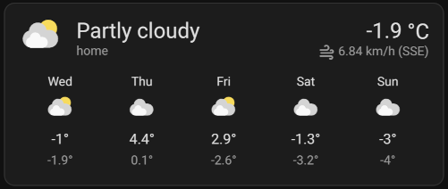
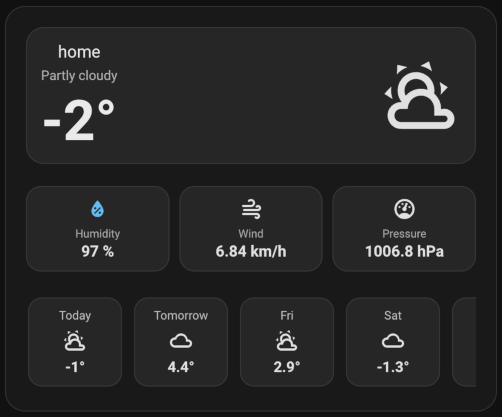

# SMHI 10 days weather prognosis for Home Assistant

[](https://github.com/hacs/integration)

Get comprehensive weather data from SMHI (Sveriges meteorologiska och hydrologiska institut) directly in Home Assistant. This custom integration uses the Open Data API to provide accurate current conditions and 10-day forecasts for any location in Sweden.

Note! Much of the code (and tests) was written by AI (Gemini and Copilot), and manually tested and heavily inspected and questioned by me in several iterations. I am a programmer in my work, but Python and Home Assistant specifics aren't my specialities.

## Sample dashboard cards

### Standard

[](assets/images/dashboard_standard_full.png)

[Dashboard YAML](assets/dashboard_samples/dashboard_standard.yaml)

### Glassmorphism

[](assets/images/dashboard_glassmorphism_full.png)

[Dashboard YAML](assets/dashboard_samples/dashboard_glassmorphism.yaml)

## Features

*   **Weather Platform**: A standard `weather` entity (e.g., `weather.smhi_home`) with current conditions and a 10-day forecast.
*   **Current Conditions**: Temperature, Humidity, Wind Speed, Wind Direction, Pressure, and Precipitation.
*   **10-Day Forecast**: Daily sensors showing the maximum temperature for the day, with detailed forecast data available as attributes.
*   **Localization**: Fully localized for English and Swedish.
*   **Easy Configuration**: Setup via the Home Assistant UI.
*   **Device panel image** (optional): render a 480x480 weather image for a wall panel or dashboard. See [Device panel image export](#device-panel-image-export).

## Installation

### Option 1: HACS (Recommended)

1.  Open HACS in Home Assistant.
2.  Go to **Integrations** > **Triple dots** (top right) > **Custom repositories**.
3.  Paste the URL of this repository: `https://github.com/Tiimber/ha-smhi-odp`
4.  Select **Integration** as the category.
5.  Click **Add**.
6.  Find **SMHI ODP** in the list and install it.
7.  Restart Home Assistant.

### Option 2: Manual Installation

1.  Download the latest release.
2.  Copy the `smhi_odp` directory to your `custom_components` folder (e.g., `/config/custom_components/smhi_odp`).
3.  Restart Home Assistant.

## Configuration

1.  Go to **Settings** > **Devices & Services**.
2.  Click **Add Integration** and search for **SMHI ODP**.
3.  Enter a friendly name (e.g., "Home").
4.  Enter your **Latitude** and **Longitude**.
5.  Click **Submit**.

## Device panel image export

Optional, and **off by default** — turning it off changes nothing about the
rest of the integration.

Small wall panels (ESP32-class touch displays and similar) can usually decode
a JPEG, but laying out and anti-aliasing a whole weather screen on-device is
another matter. This renders the screen here instead, so the device only has
to fetch one image and put it on screen.

The rendered 480x480 image contains:

*   a hero card with the current condition icon, temperature and chance of rain
*   a five-slot forecast row: the next two hours individually, then the next
    two parts of the day (morning / midday / afternoon / evening / night) as
    averages, then either tomorrow's range or a further part of the day
*   a 48-hour temperature graph from the start of today to the end of tomorrow,
    with 5-degree gridlines and a marker at the current time

The part of the graph before "now" is filled in from the recorder's history for
the weather entity, since SMHI's API only ever returns forecast data.

### Enabling it

1.  Go to **Settings** > **Devices & Services** > **SMHI ODP** > **Configure**.
2.  Turn on **Enable device panel image export**.

### Rendering

Call `smhi_odp.generate_device_panel_screen`, which writes
`/config/www/smhi_odp_panel.jpg` (reachable at `/local/smhi_odp_panel.jpg`):

```yaml
action: smhi_odp.generate_device_panel_screen
data:
  entry_id: YOUR_CONFIG_ENTRY_ID   # optional, but set it if you have several locations
```

The image is rendered on demand, so it is current as of the call. The response
includes `next_refresh_s`: the number of seconds until just after the top of
the next hour, when the forecast row's leading "next two hours" slots roll
over. Panels without a clock of their own can use that to schedule their next
request; anything else can simply re-render on whatever schedule suits.

## Sensors

The integration creates the following sensors:

### Current Conditions
*   `sensor.smhi_odp_home_temperature`
*   `sensor.smhi_odp_home_humidity`
*   `sensor.smhi_odp_home_wind_speed`
*   `sensor.smhi_odp_home_wind_direction`
*   `sensor.smhi_odp_home_pressure`
*   `sensor.smhi_odp_home_precipitation`

### Daily Forecasts
*   `sensor.smhi_odp_home_today`
*   `sensor.smhi_odp_home_tomorrow`
*   `sensor.smhi_odp_home_day_2` ... `sensor.smhi_odp_home_day_9`

*Note: The state of the daily forecast sensors is the **Maximum Temperature** for that day. Additional details are available in the sensor attributes.*

## Issues & Debugging

If you encounter issues, please check the [Issue Tracker](https://github.com/Tiimber/ha-smhi-odp/issues).
To enable debug logging, add the following to your `configuration.yaml`:

```yaml
logger:
  default: info
  logs:
    custom_components.smhi_odp: debug
```

## Credits

Created by [@Tiimber](https://github.com/Tiimber).
Data provided by [SMHI Open Data](https://www.smhi.se/data/oppna-data).

## License

This project is licensed under the MIT License. See [LICENSE](LICENSE).

Bundled third-party assets (weather icons and a font, both used only by the
device panel image export) are covered by their own permissive licences — see
[THIRD_PARTY_NOTICES.md](THIRD_PARTY_NOTICES.md).
